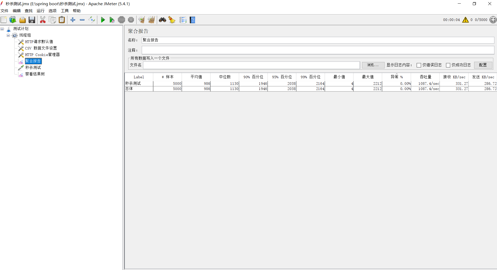
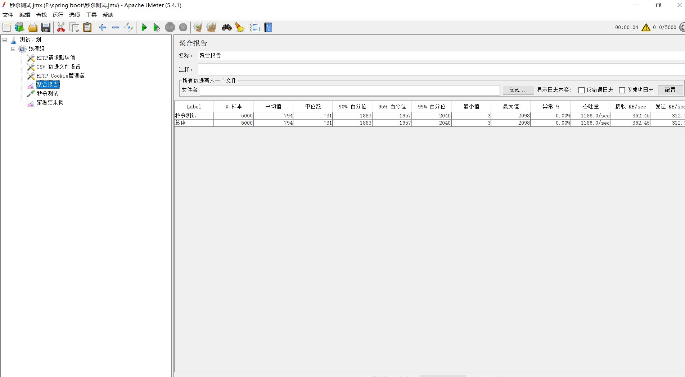

# 分布式高并发商品秒杀系统

- [介绍](#介绍)

- [快速启动](#快速启动)

- [TODO](#TODO)

- [压测结果](#压测结果)

- [Q&A](#Q&A)


## 介绍

本项目为另一个项目[dis-seckill](https://github.com/Grootzz/dis-seckill)的压力测试版本，重点工作为优化秒杀接口性能，提高单机系统并发瓶颈。

## 快速启动

- 构建工具

  | ⚔️                                               |
  | ----------------------------------------------- |
  | [apache-maven-3.6.1](https://maven.apache.org/) |

- 开发环境

- |                   🏖                    |                             🧐                              |                              🥇                               |                           🌁                            |                              🌈                               |                              🎯                               |                      🦄                       |                              🏖                               |                     🚏                      |
  | :------------------------------------: | :--------------------------------------------------------: | :----------------------------------------------------------: | :----------------------------------------------------: | :----------------------------------------------------------: | :----------------------------------------------------------: | :------------------------------------------: | :----------------------------------------------------------: | :----------------------------------------: |
  | [Java1.8](https://www.java.com/zh-CN/) | [SpringBoot 2.1.5](https://spring.io/projects/spring-boot) | [MyBatis 2.0.1](https://mybatis.org/mybatis-3/zh/index.html) | [Mysql 8.0.12](https://dev.mysql.com/downloads/mysql/) | [Dubbo 2.7.1](https://github.com/zaiyunduan123/Java-Interview/blob/master/notes/framework/Dubbo.md) | [Zookeeper 3.4.10](https://github.com/zaiyunduan123/Java-Interview/blob/master/notes/framework/Zookeeper.md) | [Rabbitmq 3.7.15](https://www.rabbitmq.com/) | [Redis  5.0.5](https://github.com/zaiyunduan123/Java-Interview/blob/master/notes/database/Redis.md) | [jmeter 5.4.1](https://jmeter.apache.org/) |


- 压力测试

  jmeter 5.4.1。测试文件路径：dis-seckill-common\stress_test\秒杀测试.jmx

在运行秒杀系统之前，需要安装好上述构建工具和开发环境，并开启相应组件后。

**第一步**；执行dis-seckill-common/schema/seckill.sql文件，初始化数据库。

**第二步**；如果安装了git，则可以采用下面的方式快速启动；

```properties
git clone https://github.com/parkt90/dis-seckill.git
mvn clean package
```
启动缓存服务：

```properties
java -jar dis-seckill-cache/target/dis-seckill-cache-0.0.1-SNAPSHOT.jar
```

启动用户服务：

```properties
java -jar dis-seckill-user/target/dis-seckill-user-0.0.1-SNAPSHOT.jar
```

启动订单服务：

```properties
java -jar dis-seckill-order/target/dis-seckill-order-0.0.1-SNAPSHOT.jar
```

启动商品服务：

```properties
java -jar dis-seckill-goods/target/dis-seckill-goods-0.0.1-SNAPSHOT.jar
```

启动消息队列服务：

```properties
java -jar dis-seckill-mq/target/dis-seckill-mq-0.0.1-SNAPSHOT.jar
```

启动网关服务：

```properties
java -jar dis-seckill-gateway/target/dis-seckill-gateway-0.0.1-SNAPSHOT.jar
```

> 注：启动服务时最好按上面的顺序启动。

如果将项目导入IDE中进行构建，则分别按上面的顺序启动服务即可，如需修改代码，可以用IDE启动项目各模块主程序。

**第三步**；访问项目入口地址

<http://localhost:8082/user/index>

初始用户手机号码：18342390420，密码：000000

## TODO

- [x] 接口压测；
- [x] 秒杀接口性能优化,提高单机秒杀接口QPS；

## 压测结果

1. 测试环境：
   - Intel(R) Core(TM) i5-10210U CPU @ 1.60GHz   2.11 GHz
   - 内存：16.0 GB（2667MHz）
   - 环境：windows10		
   - jar 运行	
   - 线程数：5000*1
   
2. 优化前：1087Qps

   

3. 优化后：1186Qps

   

## Q&A

- 前端文件资源路径：dis-seckill-gateway\src\main\resources下

- 压测文件：dis-seckill-common\stress_test\秒杀测试.jmx

- [秒杀接口性能优化及思路](doc/秒杀.md)

- [压力测试步骤和注意事项](doc/压力测试.md)

  


