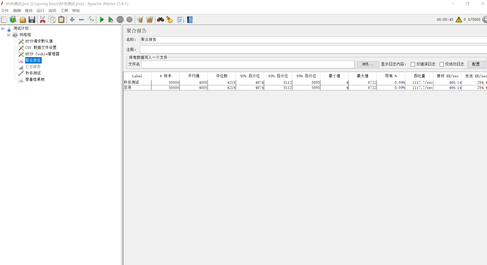

# 分布式高并发商品秒杀系统设计

- [介绍](#介绍)
- [快速启动](#快速启动)
- [系统架构](#系统架构)
- [模块介绍](#模块介绍)
- [Q&A](#Q&A)
- [TODO LIST](#TODO)
- [压测效果](#压测效果)
- [参考视频](#参考视频)

## 介绍

本项目为另一个项目[dis-seckill](https://github.com/Grootzz/dis-seckill)的分布式改进版本，意为：distributed seckill，即分布式秒杀系统。

项目实现功能包含：

- 用户注册和登录模块
- 商品信息查询模块
- 用户秒杀模块
- 订单生成模块

本项目采用微服务思想，对职责进行划分，降低单体应用的业务耦合性，每个功能模块可以分开部署，解决系统瓶颈。

## 快速启动

- 构建工具

  apache-maven-3.6.1

- 开发环境

  JDK 1.8、Mysql 8.0.12、SpringBoot 2.1.5、zookeeper 3.4.10、dubbo 2.7.1、redis 5.0.10、rabbitmq 3.8.14

- 压力测试

  jmeter 5.4.1。测试文件路径：dis-seckill-common\stress_test\秒杀测试.jmx

在安装之前，需要安装好上述构建工具和开发环境，并开启相应组件后。

**第一步**；完成数据库的初始化，使用`./dis-seckill-common/schema/seckill.sql`初始化数据库。

**第二步**；如果安装了git，则可以采用下面的方式快速启动；

```properties
git clone https://github.com/parkt90/dis-seckill.git
mvn clean package
```
启动缓存服务：

```properties
java -jar dis-seckill-cache/target/dis-seckill-cache-0.0.1-SNAPSHOT.jar
```

启动用户服务：

```properties
java -jar dis-seckill-user/target/dis-seckill-user-0.0.1-SNAPSHOT.jar
```

启动订单服务：

```properties
java -jar dis-seckill-order/target/dis-seckill-order-0.0.1-SNAPSHOT.jar
```

启动商品服务：

```properties
java -jar dis-seckill-goods/target/dis-seckill-goods-0.0.1-SNAPSHOT.jar
```

启动消息队列服务：

```properties
java -jar dis-seckill-mq/target/dis-seckill-mq-0.0.1-SNAPSHOT.jar
```

启动网关服务：

```properties
java -jar dis-seckill-gateway/target/dis-seckill-gateway-0.0.1-SNAPSHOT.jar
```

> 注：启动服务时最好按上面的顺序启动。

如果将项目导入IDE中进行构建，则分别按上面的顺序启动服务即可，如需修改代码，可以用IDE启动项目各模块主程序。

**第三步**；访问项目入口地址

<http://localhost:8082/user/index>

初始用户手机号码：18342390420，密码：000000

## 系统架构


- 注册中心使用zookeeper；
- 缓存采用redis；
- 消息队列采用RabbitMQ；
- 用户请求全部交由Gateway模块处理；
- Gateway模块使用RPC的方式调用其他模块提供的服务完成业务处理。

## 模块介绍

- dis-seckill-common：通用模块
- dis-seckill-user：用户模块
- dis-seckill-goods：商品模块
- dis-seckill-order：订单模块
- dis-seckill-gateway：网关模块
- dis-seckill-cache：缓存模块
- dis-seckill-mq：消息队列模块

## Q&A

- 前端文件资源路径：dis-seckill-gateway\src\main\resources下
- [前后端交互接口定义](https://github.com/Grootzz/dis-seckill/blob/master/doc/前后端交互接口定义.md)
- [前后端交互接口逻辑实现](https://github.com/Grootzz/dis-seckill/blob/master/doc/前后端交互接口逻辑实现.md)
- [Redis中存储的数据](https://github.com/Grootzz/dis-seckill/blob/master/doc/Redis中存储的数据.md)
- [使用分布式锁解决恶意用户重复注册问题](https://github.com/Grootzz/dis-seckill/blob/master/doc/使用分布式锁解决恶意用户重复注册问题.md)
- [秒杀接口性能优化思路（](https://github.com/parkt90/dis-seckill/tree/master/doc)近期更新）[](https://github.com/parkt90/dis-seckill/tree/master/doc秒杀接口性能优化.md)
- [秒杀接口安全优化思路](https://github.com/parkt90/dis-seckill/tree/master/doc)（近期更新）[](https://github.com/parkt90/dis-seckill/tree/master/doc秒杀接口安全性优化.md)
- ......

## TODO

- [x] 完成用户注册功能；
- [x] 引入分布式锁保证更改密码接口用户注册接口的幂等性，防止用户恶意访问；
- [x] 接口压测；
- [ ] 秒杀接口性能优化,提高单机秒杀接口QPS；
- [ ] 秒杀接口安全性优化，在前端中隐藏接口地址；
- [ ] 超高并发下对流量进行降级和限流
- [ ] gateway模块横向扩展，降低单个应用的压力；
- [ ] Nginx水平扩展;
- [ ] 服务模块横向扩展；
- [ ] 服务调用的负载均衡与服务降级；
- [ ] ......

## 压测效果

1. 测试环境：
   - Intel(R) Core(TM) i5-10210U CPU @ 1.60GHz   2.11 GHz
   - 内存：16.0 GB（2667MHz）
   - 环境：windows10				
2. 优化前：1100Qps左右




## 参考视频

- 视频资料（侵删）

  - https://www.bilibili.com/video/BV1Cp4y1b7Je?share_source=copy_web
  - https://www.bilibili.com/video/BV1Ha4y1e7Uj?share_source=copy_web
  - https://www.bilibili.com/video/BV1QJ411e78B?share_source=copy_web

- 正版网课链接：

  - http://coding.imooc.com/class/168.html

  