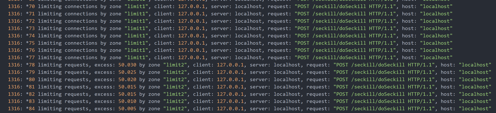

[TOC]

- [主要内容](#主要内容)

- [gateway集群配置](#gateway集群配置)

- [`nginx`访问控制](#nginx访问控制（项目中未配置）)

- [`nginx`流量控制](#流量控制)

- [思考和扩展](#思考和扩展)

  

## 主要内容

#### 本节主要介绍如何使用`nginx`对`gateway`模块进行反向代理，横向扩展gateway模块。

#### [重点为`nginx`的配置](https://www.nginx.cn/doc/)

`nginx`参考配置路径为`dis-seckill-common\nginx参考配置\nginx.conf`

## gateway集群配置

```properties
location / {
            proxy_pass http://seckill;
            proxy_redirect default;
        }
```

`http` 节点下

```properties
upstream seckill {
        server  127.0.0.1:8082; 
        server  127.0.0.1:8090;  
    }
```

通过**jar方式**启动gateway集群：

```shell
java -Dserver.port=8082 -jar dis-seckill-gateway/target/dis-seckill-gateway-0.0.1-SNAPSHOT.jar
java -Dserver.port=8090 -jar dis-seckill-gateway/target/dis-seckill-gateway-0.0.1-SNAPSHOT.jar
```

`nginx`默认启动端口为80。

windows下`nginx`启动方式。在安装目录下输入：

```shell
start nginx
```

启动后，通过访问80端口，`nginx`就可以代理请求到gateway集群。默认为轮询访问gateway模块。

## `nginx`访问控制（项目中未配置）

参考[HTTP Access 模块。](https://www.nginx.cn/doc/standard/httpaccess.html)

#### 黑名单配置

```properties
location / {
: deny    192.168.1.1;
: deny   192.168.1.0/24;
}
```

禁用单个`ip`或者某个网段。

#### 白名单配置

```properties
location / {
: allow    192.168.1.1;
: allow   192.168.1.0/24;
}
```

设置单个`ip`或者某个网段为白名单。

**高级配置**：[`Nginx`+`Lua`实现动态黑名单配置](https://blog.csdn.net/sz85850597/article/details/85223835)

## `nginx`流量控制

参考[HTTP Limit Requests模块](https://www.nginx.cn/doc/standard/httplimitrequest.html)和[HTTP Limit Zone 模块](https://www.nginx.cn/doc/standard/httplimitzone.html)

- **HTTP Limit Requests模块**对客户端**请求**进行流量控制

`http`节点配置

```properties
limit_req_zone  $binary_remote_addr zone=limit2:10m   rate=5r/s;
```

`serve`配置

```properties
 limit_req zone=limit2 burst=50 nodelay;
```

- **Http Limit zone模块**对客户端**会话**进行流量控制

`http`节点配置

```properties
 limit_conn_zone $binary_remote_addr zone=limit1:10m;
```

`serve`配置

```properties
limit_conn limit1 10;
```

- **nginx_http_upstream_module**配置

  在nginx1.11.5版本以后，可以在集群中配置，对整个系统流量进行流量控制。

```properties
 upstream seckill {
        server  127.0.0.1:8082 max_conns=1000; 
        server  127.0.0.1:8090 max_conns=1000;  
    }
```

**三种流控方式区别和联系：**

- 前两种方式都是只能单一对客户端（即单一ip）限流，第三种方式，可以针对整个系统的流量进行并发控制。
- 前两种方式区别主要是**会话**和**请求**的区别：即声明周期不同。[参考说明](https://segmentfault.com/a/1190000022303019)
- 三种方式可以同时配置，同时生效。流量规则表现为三种规则的交集。

#### 限流效果

用jmeter模拟1000个用户发起秒杀请求。限流效果可以在nginx文件logs/error.log目录下看到：



## 思考和扩展

- nginx扩展gateway模块后并取消流量控制，用jemter进行压力测试（5000*10），大概**异常率会在40%**左右，有网友也遇到[相同情况](https://q.cnblogs.com/q/109603/)。在windows中，并不能很好的支持nginx高性能配置，建议大家如果设备资源充足的情况下，可以在linux下对优化nginx配置，并对扩展后gateway模块做压力测试。
- 限流原理和项目中三级限流实现方式[参考](限流原理.md)

  - **`nginx`实现接口限流**
  - **`sentinel`实现接口限流**
  - **`redis`实现接口限流**