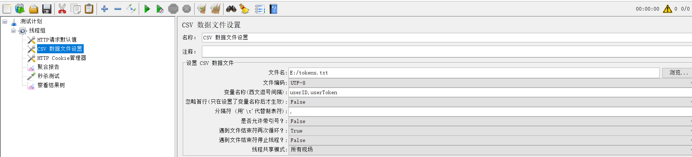

# 压力测试步骤和注意事项

[TOC]

- **[说明和启动](#说明和启动)**

- **[注意](#注意)**

## 说明和启动

优化前秒杀系统为分支[dis-seckill-origin](https://github.com/parkt90/dis-seckill/tree/dis-seckill-origin);

**第一步**：git快速下载；

```
 git clone -b dis-seckill-origin  https://github.com/parkt90/dis-seckill.git
 mvn clean package
```

**第二步**：jar动态端口启动

```
java	-Dserver.port=xxx  -jar  xxx.jar
```

1.  jar文件名可以参考master分支README.
2.  默认端口：

- |                     | dis-seckill-origin分支 | master分支 |
  | ------------------- | ---------------------- | ---------- |
  | dis-seckill-user    | 8091                   | 8081       |
  | dis-seckill-gateway | 8092                   | 8082       |
  | dis-seckill-goods   | 8093                   | 8083       |
  | dis-seckill-order   | 8094                   | 8084       |
  | dis-seckill-cache   | 8095                   | 8085       |
  | dis-seckill-mq      | 8096                   | 8086       |

**第三步**：JMeter压测；

- ​	压测文件路径：`dis-seckill-common\stress_test\`秒杀测试.jmx

  - 生成token.txt文件：运行`dis-seckill-user\src\main\java\com\seckill\dis\user\util\UserUtil.java`主函数。第一次运行要去掉以下代码注释。

    ```
    // 将用户信息插入数据库，以便在后面模拟用户登录时可以找到该用户，从而可以生成token返会给客户端，然后保存到文件中用于压测
    // 首次生成数据库信息的时候需要调用这个方法，非首次需要注释掉
    /*  try {
                insertSeckillUserToDB(users);
            } catch (ClassNotFoundException e) {
                // TODO Auto-generated catch block
                System.out.println("erro1");
                e.printStackTrace();
            } catch (SQLException e) {
                // TODO Auto-generated catch block
                System.out.println("erro2");
                e.printStackTrace();
            } 
       */
    ```

    

  - 将用户信息注意配置生成token.txt文件路径。

    ```java
    File file = new File("E:/tokens.txt");
    ```

    

- JMeter配置：

  - CSV文件配置,选择上面配置的token.txt文件路径；

    


​		

## 注意

#### **压力测试数据：**

1. **项目运行起来后，第一次测试由于`DispatcherServlet`初始化导致Qps偏低，可以换不同`goodsId`多测试几次，然后取平均值。**
1. **测试数据包含异常结果时，会导致QPS偏高，尽量选取没有异常的测试结果为最终结果。**
1. **本次测试采用jar方式运行，windows环境，注释掉了`dis-seckill-gateway`模块部分日志信息。在dos窗口打印和日志存储发送资源抢占，导致比[编译器直接运行效率低不少。](https://www.zhihu.com/question/266331490)**

#### **测试热加载接口：**

```java
  @RequestMapping(value = "test", method = RequestMethod.GET)
  @ResponseBody
  public Result<Boolean> test() {
      logger.info("商品信息热加载");
      afterPropertiesSet();
      return Result.success(true);     
    }
```

通过该接口，调用`afterPropertiesSet()`函数，重新把数据库的库存加载到redis中，并清除内存标记。

