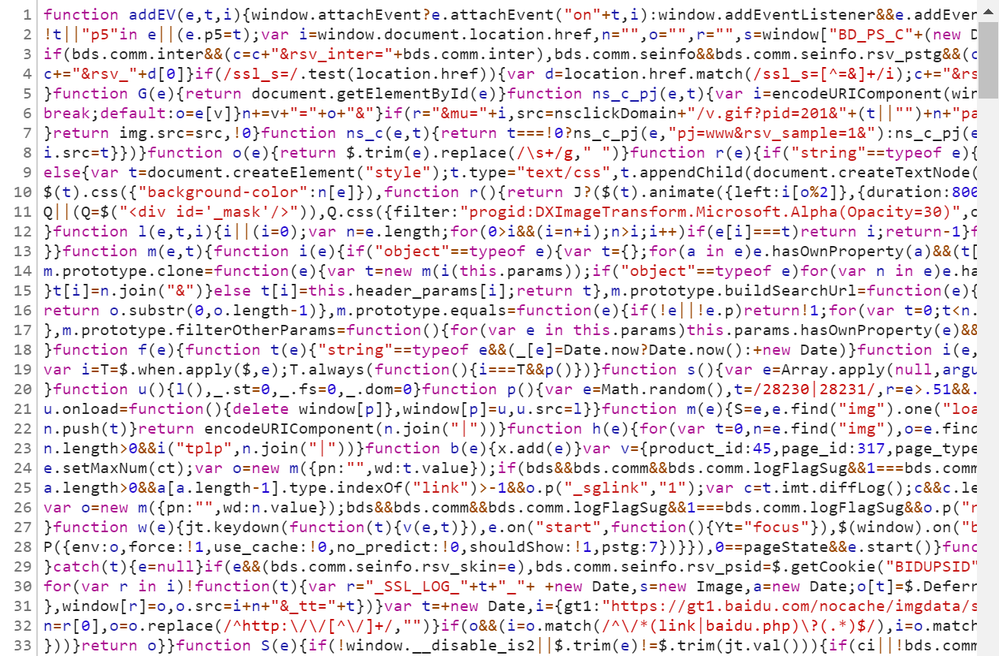
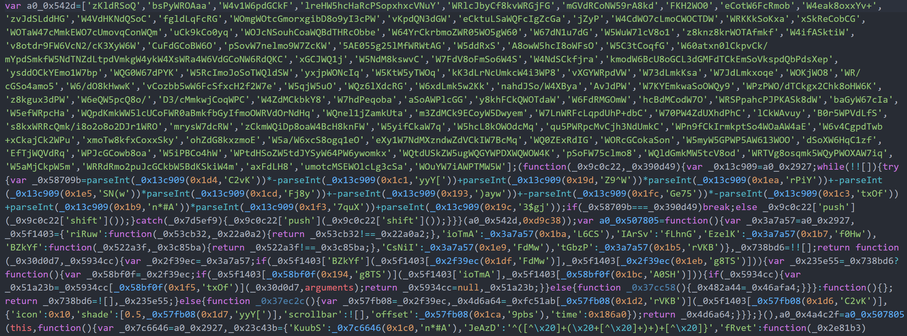
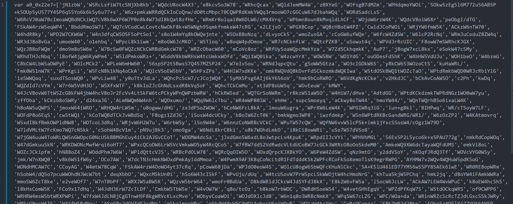

#### 

- [秒杀接口隐藏](#秒杀接口隐藏)

- [后端接口隐藏](#后端接口隐藏)

- [参考资料](#参考资料)

  

## 秒杀接口隐藏

#### **为什么要做秒杀接口地址的隐藏？**

首先看客户端秒杀执行的逻辑：

```html
<button class="btn btn-primary" type="button" id="buyButton" onclick="doMiaosha()">立即秒杀</button>
```

秒杀前，我们对秒杀按钮置灰处理，这样可以防止用户前发起秒杀请求。

```javascript
function doSeckill() {
    $.ajax({
        url: "/seckill/doSeckill",
        type: "POST",
        data: {
            goodsId: $("#goodsId").val(),
        },
        success: function (data) {
            if (data.code == 0) {
                getSkResult($("#goodsId").val());
            } else {
                layer.msg(data.msg);
            }
        },
        error: function () {
            layer.msg("客户端请求有误");
        }
    });
}
```

但是对于稍微懂一点电脑的用户，可以用`F12`打开调式界面，看到后端的接口。只要稍微写点爬虫代码，模拟一个抢购请求，就可以不通过点击下单按钮，然后不停地向服务器请求资源，则会给服务器带来很大的压力。同时，该脚本程序可以不断获取最新的北京时间，达到毫秒级别的，可以在00毫秒的时候发起秒杀请求，这样比人工点击秒杀按钮的成功率大高多了，造成了秒杀的不公平性，所以需要隐藏秒杀接口。

#### **但是，通过影藏秒杀接口，能够防住通过脚本刷接口的人吗？**

#### **能，也不能。**

**可以防住的是直接请求接口的人，但是只要坏蛋们把脚本写复杂一点，先去请求一个验证值，再立刻请求抢购，也是能够抢购成功的。**

不过坏人们请求验证值接口，**也需要在抢购时间开始后**，才能请求接口拿到验证值，然后才能申请抢购接口。**理论上来说在访问接口的时间上受到了限制，并且我们还能通过在验证值接口增加验证码验证，让获取验证值的接口并不快速返回验证值，进一步拉平普通用户和坏人们的下单时刻**。所以这样做还是有用的！

#### **抢购接口隐藏（接口加盐）的具体做法**：

- 每次点击秒杀按钮，先从服务器获取一个秒杀验证值**path**（接口内判断是否到秒杀时间）。
- `Redis`以缓存用户ID和商品ID为Key，秒杀地址为Value缓存验证值
- 用户请求秒杀商品的时候，要带上秒杀验证值**path**进行校验。

## 后端接口隐藏

### 后端接口的暴露的风险：

- 一是别有用心之人可以随便用脚本模拟请求，消耗服务器资源，对服务造成很大压力。
- 严重时，有可能通过模拟接口请求，获取后端服务器敏感信息。

### 解决方案：

1. #### **压缩`js`代码**

   代码压缩，就是去除 `JavaScript` 代码中不必要的空格、换行等内容，把一些可能公用的代码进行处理实现共享，最后输出的结果都压缩为一行或者几行内容，代码可读性变得很差，同时也能提高网站加载速度，就像下面这样：

   

这个是从百度的页面上随便找了一个 `js` 截出来。

**如果是单纯从去除空行空格这个角度上来对代码进行压缩，其实只能起到一点点防护作用，因为这种压缩方式仅仅是降低了代码的直接可读性。**

**整体上来讲， `JavaScript` 压缩术只能在很小的程度上起到防护作用，要想真正提高防护效果还得依靠 `JavaScript` 混淆和加密技术**

2. #### 混淆`js`代码（项目中使用）

`JavaScript` 混淆是完全是在 `JavaScript` 上面进行的处理，它的目的就是使得 `JavaScript` 变得难以阅读和分析，大大降低代码可读性，是一种很实用的 `JavaScript` 保护方案。

JavaScript 混淆器大致有两种:

- **通过正则替换实现的混淆器**
- **通过语法树替换实现的混淆器**

第一种实现成本低，但是效果也一般，适合对混淆要求不高的场景。第二种实现成本较高，但是更灵活，而且更安全，更适合对抗场景。

通过语法树替换实现的混淆器，这种混淆方式的实现有点复杂了，[**参考实现**](https://www.zhihu.com/question/47047191/answer/121013968)

**总之，以上方案都是 JavaScript 混淆的实现方式，可以在不同程度上保护 JavaScript 代码。**

在一般的场景中，第一种混淆方式足够我们使用，现在 JavaScript 混淆主流的实现是 `javascript-obfuscator` 这个库，利用它我们可以非常方便地实现页面的混淆，使得混淆后 `JavaScript` 可读性大大降低，难以逆向。

3. #### 	.加密`js`代码

不同于 `JavaScript` 混淆技术，`JavaScript` 加密技术可以说是对 `JavaScript` 混淆技术防护的进一步升级，其基本思路是将一些核心逻辑使用诸如 C/C++ 语言来编写，并通过 JavaScript 调用执行，从而起到二进制级别的防护作用。

**其加密的方式现在有 `Emscripten` 和 `WebAssembly` 等，但是实现偏难，感兴趣的同学可以自行谷歌了解下。**

### 项目中`js`混淆方案：

 项目中[`javascript-obfuscator`](https://www.npmjs.com/package/javascript-obfuscator#user-content-stringarrayencoding)这个库（需要安装node）

```shell
npm install javascript-obfuscator -g
```

对`seckill.js`和`common.js`进行代码混淆，混淆后命名为`seckill_encode.js`和`common_encode.js`。

在路径`dis-seckill-gateway\src\main\resources\static\js`下，输入以下命令：

```shell
javascript-obfuscator seckill.js --config test.json --output seckill_encode.js
```

```shell
javascript-obfuscator common.js --config test.json --output common_encode.js  
```

`test.json`参考配置：

```json
{
    "compact": true,
    "controlFlowFlattening": true,
    "controlFlowFlatteningThreshold": 0.75,
    "deadCodeInjection": true,
    "deadCodeInjectionThreshold": 0.4,
    "debugProtection": false,
    "debugProtectionInterval": false,
    "disableConsoleOutput": true,
    "identifierNamesGenerator": "hexadecimal",
    "log": false,
    "renameGlobals": false,
    "rotateStringArray": true,
    "selfDefending": true,
    "stringArray": true,
    "stringArrayEncoding": ["rc4"],
    "stringArrayThreshold": 0.75,
    "unicodeEscapeSequence": false
}
```

**为了方便阅读和修改。保留了`seckill.js`和`common.js`这2个文件，但是项目中并未使用。**

**混淆后代码：**

`common_encode.js:`



`seckill_encode.js`:



## 参考资料

- [抢购接口隐藏](https://mp.weixin.qq.com/s?__biz=MzU1NTA0NTEwMg==&mid=2247484184&idx=1&sn=8b878e9e730a6e4da27ed336c8201c92&lang=zh_CN#rd)
- [如何保障`API`接口安全性](https://www.cnblogs.com/Leo_wl/p/13047817.html)


