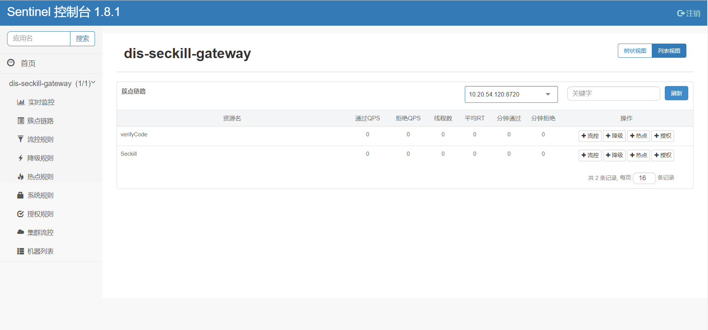
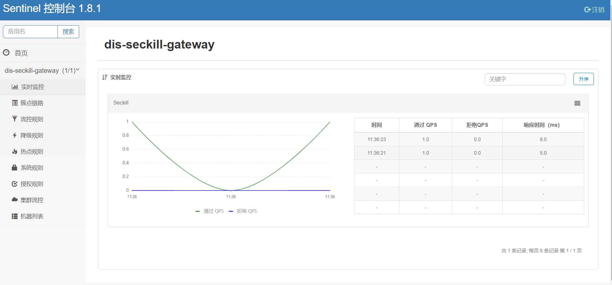

[TOC]

- **[主要内容](#主要内容)**

- **[sentinel使用](#sentinel使用)**

- [**问题思考**](#问题思考)

  

## 主要内容

#### 本节主要介绍如何使用sentinel对系统后端接口进行流控和降级。

有关限流原理和项目中三级限流实现方式[参考](限流原理.md)

- **`nginx`实现接口限流**
- **`sentinel`实现接口限流**
- **`redis`实现接口限流**

## sentinel使用

#### Sentinel 是什么？

Sentinel是阿里开源的项目。Sentinel 以流量为切入点，从**流量控制、熔断降级、系统负载**保护等多个维度保护服务的稳定性。

Sentinel 具有以下特征:

- **丰富的应用场景**：Sentinel 承接了阿里巴巴近 10 年的双十一大促流量的核心场景，例如秒杀（即突发流量控制在系统容量可以承受的范围）、消息削峰填谷、集群流量控制、实时熔断下游不可用应用等。
- **完备的实时监控**：Sentinel 同时提供实时的监控功能。您可以在控制台中看到接入应用的单台机器秒级数据，甚至 500 台以下规模的集群的汇总运行情况。
- **广泛的开源生态**：Sentinel 提供开箱即用的与其它开源框架/库的整合模块，例如与 Spring Cloud、`Dubbo`、`gRPC` 的整合。您只需要引入相应的依赖并进行简单的配置即可快速地接入 Sentinel。
- **完善的 `SPI` 扩展点**：Sentinel 提供简单易用、完善的 `SPI` 扩展接口。您可以通过实现扩展接口来快速地定制逻辑。例如定制规则管理、适配动态数据源等。

#### [快速开始](https://sentinelguard.io/zh-cn/docs/quick-start.html)

#### 项目中使用

**资源**和**规则**是`sentinel`中的核心概念。要实现限流和降级必须定义这2个核心部分。

1. #### **定义资源**（防止代码侵入，项目中使用注解方式）

对**获取验证码接口**和**秒杀接口**定义资源

接口：`seckill/path`

```java
@SentinelResource(value = "Seckill",blockHandler ="blockHandlerFordoSeckill",blockHandlerClass = {MyBlockHandler.class})
```

接口：`seckill/verifyCode`

```java
 @SentinelResource(value = "verifyCode",blockHandler ="blockHandlerForVerifyCodel",blockHandlerClass = {MyBlockHandler.class})
```

异常处理函数`blockHandler`保存在

`dis-seckill-gateway\src\main\java\com\seckill\dis\gateway\exception\MyBlockHandler.java`。在这个类中集中处理流控异常。

```java
@Component
public class MyBlockHandler  {
    
    private static Logger logger = LoggerFactory.getLogger(GlobalExceptionHandler.class);
    
    public static  Result<Integer> blockHandlerFordoSeckill ( UserVo user,
    @RequestParam("goodsId") long goodsId,	BlockException ex) {                                        
        logger.info("秒杀接口限流");
        return Result.error(CodeMsg.SERVER_BUSY);
    }
    
    public static  Result<String>  blockHandlerForVerifyCodel ( HttpServletResponse response,UserVo user,
    @RequestParam("goodsId") long goodsId,	BlockException ex) {
        logger.info("验证码接口限流");
        return Result.error(CodeMsg.SERVER_BUSY);
    }

 }
```

2. #### 配置规则

为了实现规则的动态配置，推荐使用**[sentinel控制台](https://sentinelguard.io/zh-cn/docs/dashboard.html)**。`sentinel`jar包路径`dis-seckill-common\sentinel\sentinel-dashboard.jar`

#### sentinel控制台启动

```shell
java -Dserver.port=8080 -jar sentinel-dashboard.jar 
```

端口可根据需要做修

#### 网关模块接入sentinel控制台

1. jar启动

```shell
java -Dcsp.sentinel.dashboard.server=localhost:8080 -Dproject.name=dis-seckill-gateway	-jar dis-seckill-gateway/target/dis-seckill-gateway-0.0.1-SNAPSHOT.jar
```

2. 编译器启动

   - IDEA

     `VM` options中[配置](https://blog.csdn.net/qq_42164368/article/details/108073538)

     ```
     -Dcsp.sentinel.dashboard.server=localhost:8080 -Dproject.name=dis-seckill-gateway
     ```

   - `VScode`

     `.vscode\launch.json`添加`vmArgs`配置

     ```json
     {
         "type": "java",
         "name": "Spring Boot-GatewayApplication<dis-seckill-gateway>",
         "request": "launch",
         "cwd": "${workspaceFolder}",
         "console": "internalConsole",
         "mainClass": "com.seckill.dis.gateway.GatewayApplication",
         "projectName": "dis-seckill-gateway",
         "args": "",
         "vmArgs": "-Dcsp.sentinel.dashboard.server=localhost:8080 -Dproject.name=dis-seckill-gateway",
     }
     ```

#### sentinel控制台动态配置流控

##### 规则配置：



##### 流控监测：



## 问题思考

#### 为什么不在全局异常处理函数捕获流控异常？

根据官方文档：

| 若未配置 `blockHandler`、`fallback` 和 `defaultFallback`，则被限流降级时会将 `BlockException` **直接抛出** |
| ------------------------------------------------------------ |

也就是说可以在全局异常函数`dis-seckill-gateway\src\main\java\com\seckill\dis\gateway\exception\GlobalExceptionHandler.java`类中捕获`BlockException`。

**但是：**

无论在`exceptionHandler`添加异常捕获

```java
 else if (e instanceof BlockException) {
     logger.info("限流");
     return Result.error(CodeMsg.SERVER_BUSY);
 } 
```

还是单独捕获`BlockException`异常

```java
 @ExceptionHandler(BlockException.class)
 public Result<String> sentinelBlockHandler(){
     logger.info("限流");
     return Result.error(CodeMsg.SERVER_BUSY);
 }
```

在`sentinel1.8.1`都无法在`GlobalExceptionHandler`中正常捕获。

[经过查询资料](https://blog.csdn.net/qq_30285985/article/details/107692608)，发现controller的流量控制是通过Filter来控制的，所以spring的全局异常根本无法捕获。

[参考](https://blog.csdn.net/wuningw/article/details/110946396)修改为实现 `BlockExceptionHandler`来捕获`BlockException`异常

```java
@Component
public class MyBlockHandler implements BlockExceptionHandler {

	@Override
	public void handle(HttpServletRequest request, HttpServletResponse response, BlockException ex) throws Exception {
		String msg = null;
		if (ex instanceof FlowException) {
			msg = "限流了";
		} else if (ex instanceof DegradeException) {
			msg = "降级了";
		} else if (ex instanceof ParamFlowException) {
			msg = "热点参数限流";
		} else if (ex instanceof SystemBlockException) {
			msg = "系统规则（负载/...不满足要求）";
		} else if (ex instanceof AuthorityException) {
			msg = "授权规则不通过";
		}

		// http状态码
		response.setStatus(500);
		response.setCharacterEncoding("utf-8");
		response.setHeader("Content-Type", "application/json;charset=utf-8");
		response.setContentType("application/json;charset=utf-8");
		// msg可以是對象
		new ObjectMapper().writeValue(response.getWriter(),Result.error(CodeMsg.SERVER_BUSY));
	}

}


```

经测试，发现在1.8.1版本仍然无效。有网友说1.7.1版本可以成功。

**有兴趣的同学可以自己下去试试。本项目暂时采取上面在异常处理函数`blockHandler`中处理异常的方式。**

