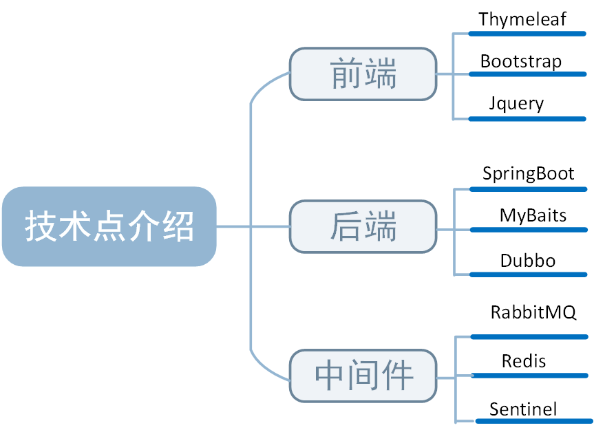

[TOC]

- [项目技术结构图](#项目技术结构图)
- [登录实现](#登录实现)

## **项目技术结构图**

## 登录实现

#### **登录部分主要有以下几个部分：**

- 明文密码两次`MD5`处理
- 分布式Session
- `JSR303`参数检验和全局异常处理器

#### 1. 两次`MD5`加密

- 客户端：C_PASS=`MD5`(明文+固定salt)
- 服务端：S_PASS=`MD5`(C_PASS+随机salt)

将用户输入的密码和固定Salt通过`MD5`加密生成第一次加密后的密码，再讲该密码和随机生成的Salt通过`MD5`进行第二次加密，最后将第二次加密后的密码和第一次的固定Salt存数据库。

好处：

1. 第一次作用：防止用户明文密码在网络进行传输
2. 第二次作用：防止数据库被盗，避免通过`MD5`反推出密码，双重保险**（个人不太理解）**

#### 2. 分布式session

验证用户账号密码都正确情况下，通过`UUID`生成唯一id作为token，再将token作为key、用户信息作为value模拟session存储到`redis`，同时将token存储到cookie，保存登录状态

好处： 在分布式集群情况下，服务器间需要同步，定时同步各个服务器的session信息，会因为延迟到导致session不一致，使用`redis`把session数据集中存储起来，解决session不一致问题。

#### 3. `JSR303`自定义参数验证

`JSR303` 是一套 `JavaBean` 参数校验的标准，它定义了很多常用的校验注解。如`@NotNull`、`@Email`、`@Max`等。

在这个系统中，我们自定义了一个注解`@IsMobile`完成手机号码的参数检验,`@IsMobile`的校验处理器为`IsMobileValidator`。

定义一个全局异常`GlobalException`和全局异常处理器`GlobalExceptionHandler`，可以完成系统异常的捕获和异常的统一处理。

#### 4. 全局异常统一处理

通过拦截所有异常，对各种异常进行相应的处理，当遇到异常就逐层上抛，一直抛到最终由一个统一的、专门负责异常处理的地方处理，这有利于对异常的维护。

#### 5. 使用数学公式验证码

**描述**：点击秒杀前，先让用户输入数学公式验证码，验证正确才能进行秒杀。

**好处**：

1. 防止利用机器人等手段防止非目标用户参与秒杀；
2. 减少单位时间内的请求数量。对于一个秒杀商品，在开始秒杀后肯定会有许多用户参与秒杀，那么在开始秒杀的时候，用户请求数量是巨大，从而对服务器产生较大的压力，而通过验证码的方式就可以有效地将集中式的请求分散，从而达到削减请求峰值的目的。

**实现思路：**：

在服务端计算出验证码的表达式的值，存储在服务端`redis`缓存中，客户端输入验证码的表达式值，传入服务端进行验证。

- 点击秒杀之前，向让用户输入验证码，分散用户的请求；
- 添加生成验证码的接口；
- 在获取秒杀路径的时候，验证验证码；
- `ScriptEngine`的使用（用于计算验证码上的表达式）。

